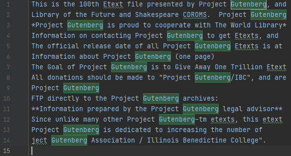

# Java Grep Tool

Filtering through text to find key words is time consuming, and it gets even more difficult if the files contain thousands of lines of text. The Java Grep Tool provides a simple way to allow a user to search through multiple files for lines containing specific words.

Developed using **Java** with the **Maven** project management tool. Utilizes Java **streams** for efficiency and packaged using **Docker**.

## How do I use it?
To use the app, simply pull the docker image from DockerHub, using:
```
$ docker pull nalimuradov/grep
```

Next, just start a container from that image with the three parameters required:
```
$ docker run nalimuradov/grep regex rootPath outFile
```

The **regex** argument is the regular expression you're filtering for.

The **rootPath** argument is the path of the directory that contains all the files you want to read from.

The **outFile** argument is the name of the file that will store the results.

## Implemenation
First, we initialize a list that will store all matching lines. These will be the results returned to the user.
```
List<String> matchedLines = new ArrayList<String>();
```

Next, we iterate through each file in the specified directory. For each file, we look through each line and check if it contains the regular expression given. If it does, we append it to the list containing the results.
```
for (File file : listFiles(rootPath)) {
    for (String line : readLines(file)) {
        if (containsPattern(line)) {
            matchedLines.add(line);
        }
    }
}
```

Finally, we write all the results to an output file that is saved in the data directory.
```
writeToFile(matchedLines);
```

## Performance Issues and Fix
When dealing with large files, Java will try to allocate all the memory required beforehand. If this exceeds the limit specified, it will crash the app. 

To overcome this challenge, Java **streams** were used instead of loops so that we only store what is currently needed and we clear it when we're done with it. This allows the application to perform the same task with a fraction of the memory.

## Testing
Testing was performed manually on sample text files containing varying amounts of text. Results are then saved to an output text file.

Below is an example of the results when we search for the word **Gutenberg** in a text file that contains all the works of Shakespeare in it: 


> The word **Gutenberg** appears 14 times total. The full line containing the word is returned because the regex specified that.

## Deployment
The app was deployed as a **DockerFile** on DockerHub. Maven was used to package the project and a Docker image was created locally with the help of the **Maven Shade plugin**, which packaged all the dependencies required to run it. 

## Future Improvements
* **File Path Clarity**
    * Errors often happen due to filepaths being misaligned across different machines. A helpful inclusion would be to log the path of the output file to the console so that the user knows where to look if they can't find it. On the same note, it could mention the directory the program is currently looking in if input files cannot be found.

* **Nested Directories**
    * As of right now, the project will only look through the files directly in the directory specified, and it will not go deeper into sub-directories that may have more files. Offering a way to check all subdirectories can be of great use when dealing with lots of files that may be scattered across multiple folders.

* **File Filtering**
    * If users have lots of files and don't want all to be searched, providing a way to filter some files by their name can be very handy. Not only will it save the user the trouble of manually removing what they don't want, the runtime will be much quicker because filtered files won't even have to be looked through.
