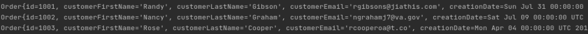

# JDBC App
Nearly every application in this current age of software uses data stored in databases.
While database languages such as SQL are great for modifying information, 
it's often necessary to connect the data to a programming language such as Java or Python for 
creating deployable products.

This application uses **JDBC** to connect **Java** to a **PostgreSQL** database that 
contains generated sales order information. Packaged using **Maven**.

## The Data
Several tables of sales information were generated to effectively run and test the application.

**Products** are mapped to **order items** that are ordered by the **customer** from the **salesperson**.
These **orders** have a **many-to-one** relationship with the customers, salespersons, and order items.

> An ER diagram that demonstrates the entities and relationships of the database.

## Design Patterns
This application uses a **Data Access Object** (DAO) design. 

DAO designs consist of a base class that will have table properties, such as a name or age, as well as an interface that will 
contain the CRUD (Create, Read, Update, Delete) operations.
We can then implement that interface while using the base class properties.

DAO provides a layer of separation from the database, meaning we can switch from a PostgreSQL to a MySQL database with minimal changes. 
DAO also works well with normalized data, as the table joins become much simpler.

Another design we could have used is the **repository** pattern, where we focus on accessing only a single table per class.
Had the database been distributed, this pattern would have been a great alternative. The repository design would allow 
us to shard the database so that if data is requested, we only fetch from the shards that have what we need.

## Usage and Testing
To start the app, a PostgreSQL server should be running so that the **JDBC executor** can establish a connection. From this point on,
this connector can be used to create queries and fetch or modify the data.

Two key files are heavily involved with operationality:

**JDBCExecutor.java**
> Entry point of the JDBC app. Establishes the connection to the database. Implemented queries can be called here.

**psql_docker.sh**
> Bash script that creates, starts, or stops a PostgreSQL Docker instance. Located in the Linux/SQL project files and reused here to start the database.

All sorts of CRUD operations are functional, and additional ones can be easily implemented thanks to the DAO pattern.
Below is an example of data pulled into Java from PostgreSQL.

> Query results of three sales orders. Contains data such as customer name and email.

Enjoy!
