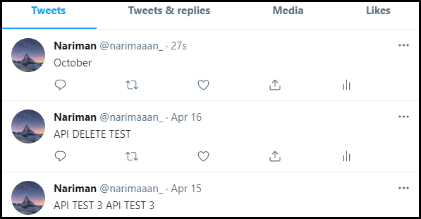
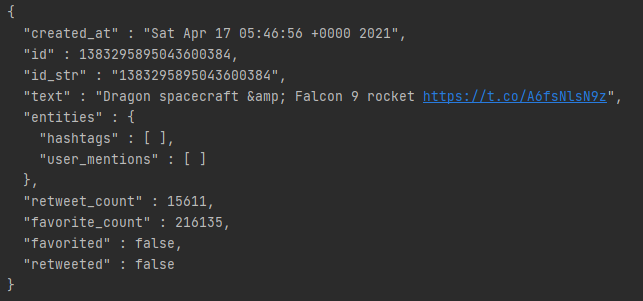
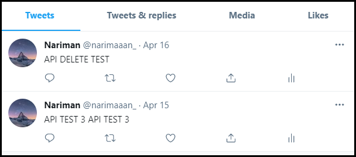

# Twitter API App
The Twitter API app is a CLI tool that provides a way to use Twitter without accessing the website directly. 
A user is able to perform basic functions such as posting tweets, reading tweets, and 
deleting tweets through the comfort of their command line.

This **Java** application uses an **HTTP client** to call the **Twitter REST API**. 
Structured using **Maven** and **Springboot** and implements a **Data Access Object** (DAO) design. 
Deployed using on **Docker** and available on **DockerHub**.

## How do I use it?
First, pull the docker image from DockerHub:
```
$ docker pull nalimuradov/twitter
```

Next, start a container from that image:
```
$ docker run -e consumerKey=YOUR_CONSUMER_KEY -e consumerSecret=YOUR_CONSUMER_SECRET -e accessToken=YOUR_ACCESS_TOKEN -e tokenSecret=YOUR_TOKEN_SECRET nalimuradov/twitter post|show|delete args
```

The first four values are the API keys that need to be set in the environment. These can be obtained from Twitter.

After the environment variables have been set, we can either **post**, **show**, or **delete** a Tweet.

<br />

**Posting** a Tweet will require us to pass the Tweet text as an argument. Optionally, we can also pass location 
coordinates, in the form *longitude:latitude*.

```
$ docker run nalimuradov/twitter post "This is my Tweet" 30.1:30.2 
```
> This will post a Tweet that says, "This is my Tweet", from Egypt.

<br />

**Showing** a Tweet will require us to pass the Tweet ID as an argument. Optionally, we can pass further **field** arguments,
which will allow us to filter our resulting output to only include the fields we specified.

```
$ docker run nalimuradov/twitter show 1383295895043600384 "created_at,text,retweet_count"
```
> This will show a Tweet made by Elon Musk. The output will only include the date it was created at, 
> the text content, and the retweet count, as per the fields.

<br />

**Deleting** a Tweet will require us to pass the Tweet ID as an argument. Multiple Tweets can be deleted at once by passing
a comma separated sequence of Tweet IDs as the argument.

```
$ docker run nalimuradov/twitter delete 1383170143665192961,1382768599908110344
```
> This will delete two Tweets with those Tweet IDs. Only your own Tweets can be deleted.

## Design
### UML diagram


The implementation consists of five main components. 

**CLI App**

This file handles arguments and passes them on to the **controller**. It will then take the result and output it as JSON into the console. 
Each dependency is created here, and the API key environment variables are sent to the HTTP helper.

**Controller**

The controller parses the arguments and formats them for the **service**. Tweet objects are instantiated here
that will be used to store and send data throughout the components. 

**Service**

The service checks the business logic and ensures the arguments are valid. 
For example, we make sure that the Tweet is not over the character limit, and the coordinates are within range.
It then sends the valid results to the **DAO**.

**DAO**

The DAO will build the URI that will be used to make the HTTP request using the validated arguments. 
This URI is then finally sent to the **HTTP helper**.

**HTTP Helper**

The HTTP helper will use the URI to execute the HTTP request to post, show, or delete a Tweet.

### Models
In our DAO design, we create a **Tweet** object that is used to represent the Tweets we work with.
It contains all the important properties of a Tweet, such as text content and date of creation.
Some properties are objects themselves, so there is a model for each of those. 
These include the **coordinates** and **entities**. 
An entity consists of two more objects: a list of **hashtags**, and a list of **user mentions**.
This Tweet model is passed throughout the components and eventually converted to JSON when outputting.

### Spring
When projects grow large enough, dependency management can become both tedious and error-prone.
  To combat this, Spring was used to manage the dependencies throughout the project. 
  Marking the components as *@Components* will let Spring know that it is a Spring Bean, ensuring that it 
  will be managed by the Spring IoC container.

## Testing and Examples
All key components were tested using **unit tests** as well as **integration tests** in JUnit.
Unit tests were performed using Mockito to ensure that each component works in isolation. 
Dependencies were mocked to return expected results to ensure that each part ran correctly.
Integration tests were also implemented to make sure the actual functionality of the system was operational.

### Example Post



> A new Tweet with text "October" was created.

### Example Show

> The contents of the Elon Musk Tweet used in the usage example.

### Example Delete



> You can see the "October" Tweet is no longer there.

## Improvements

* **Showing Multiple Tweets**
    * While our delete option allows for deleting multiple Tweets at once, implementing that option into the show method
  could be very useful for aggregating lots of data such as Tweet text contents. 
 This would allow for a very efficient method of data collection for use in tasks involving machine learning and 
      natural language processing.


* **Double Post Error Handling**
  *  To prevent botting, Twitter doesn't allow users to post the same Tweet twice in a row.
     I could better handle these errors by including a file that stores the most recently posted Tweet and
     comparing during every post request.


* **Twitter Post Database Storage**
    * In conjunction with the first improvement, I could implement a way to send JSON Tweet information
  directly to a database. This would allow Tweet contents to persist after running, 
      and would further help with any data aggregation goals.
