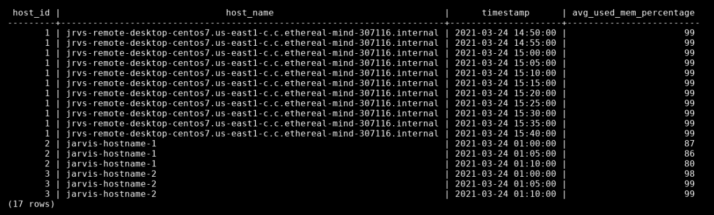

# Linux Cluster Monitoring Agent

Monitoring multiple machines can be tricky, and aggregating that information to one location can be even trickier. This monitoring agent system aims to simplify and automate this to allow for ease-of-use and scalability. A beginner Linux user looking to monitor their machine(s) should have no trouble following along.

The project files contain the scripts that will pull the machine information as well as provide a way to set up the database.

Key technologies used: **Bash**, **PostgreSQL**, **Docker**, **Git**, **Linux**


## How do I use it?

First, we want to create a PSQL Docker container using the **create** option. If it already exists, we can simply pass **start** as the only option instead.
```
$ bash scripts/psql_docker.sh create db_username db_password
```

There are variable names in the following commands, here are the values you may want to use:

| Variable  | Example Value |
| ------------- | ------------- |
| psql_host | localhost |
| psql_port | 5432 |
| db_name | host_agent |
| psql_user | postgres |

It's important to connect to PSQL and create the **database** if it has not been created yet.
```
$ psql -h psql_host -U psql_user -W
postgres=# CREATE DATABASE host_agent;
```

Now, we can run our **ddl** file that will set up the tables required to store our data.
```
$ psql -h psql_host -U psql_user -d db_name -f sql/ddl.sql
```

The host scripts will do the heavy lifting of obtaining the data. Both will require a **hostname**, a **port number**, a **database name**, a **PSQL username**, and a **PSQL password** as arguments. It's necessary to run host_info **first** as host_usage must fetch data from host_info.
```
$ bash scripts/host_info.sh psql_host psql_port db_name psql_user psql_password
$ bash scripts/host_usage.sh psql_host psql_port db_name psql_user psql_password
```

**Crontab** can be used to periodically fetch the host_usage data. Open the crontab with ```$ crontab -e``` and insert the following line to have the system usage be read and stored every minute.
```
* * * * * bash full_path_to/host_usage.sh psql_host psql_port db_name psql_user psql_password > /tmp/host_usage.log
```

Test out your work with **queries.sql**. Run it to see if the sample queries are operational.
```
$ psql -h psql_host -U psql_user -d db_name -f sql/queries.sql
```

# Implementation
**Bash scripts** are used to collect hardware specifications as well as resource usage.
These values are then stored in a **PostgreSQL** database provisioned using **Docker**. The resource usage is scheduled using a **Crontab** file. Requested information is then pulled from the database using  **SQL** queries.

## Architecture
A **client-server** architecture is used. Each client computer will have a copy of the script, while the server computer will also store the database.


## What do the scripts do?
This project consists of five key scripts, as well as a Linux **crontab** for periodic data collection:

**psql_docker.sh**
> Shell script that is used to create, start, or stop the PostgreSQL Docker container. A username and password must be passed if creating the container.

Usage: ```bash scripts/psql_docker.sh create|start|stop [db_username] [db_password]```
<br/><br/>

**host_info.sh**
> Shell script that will fetch the **hardware specifications** of the machine and insert it into the database. The hostname, port number, database name, database username, and database password must be passed.

Usage: ```bash scripts/host_info.sh localhost 5432 host_agent postgres your_password```
<br/><br/>

**host_usage.sh**
> Shell script that will fetch the **resource usage** of the machine and insert it into the database. The hostname, port number, database name, database username, and database password must be passed.

Usage: ```bash scripts/host_usage.sh localhost 5432 host_agent postgres your_password```
<br/><br/>

**ddl.sql**
> Creates the SQL table structure that will be used to store the data obtained from **host_info.sh** and **host_usage.sh**.

Usage: ```psql -h localhost -U postgres -W sql/ddl.sql```
<br/><br/>

**queries.sql**
> Contains some sample queries that

Usage: ```psql -h localhost -U postgres -W sql/queries.sql```
<br/><br/>

**crontab**
> A special file that is used to periodically run a file over and over again. Very useful for active monitoring processes.

## Database Modeling

The information being recorded from both scripts consists of the following:

**Host Information Table**

| Column  | Description |
| ------------- | ------------- |
| id | Unique identifier for distinguishing different computers |
| hostname | Unique name of the computer |
| cpu_number | Number of CPUs in the computer |
| cpu_architecture | Architecture of the computer |
| cpu_model | Model of the computer |
| cpu_mhz | Clock speed |
| L2_cache | CPU cache (in KB) |
| total_mem | Total computer memory (in KB) |
| timestamp | Time when this information was recorded |

**Host Usage Table**

| Column  | Description |
| ------------- | ------------- |
| timestamp | Time when this information was recorded |
| host_id | Unique identifier for distinguishing different computers |
| memory_free | Amount of free memory (in MB) |
| cpu_idle | Percentage of CPU not being used  |
| cpu_kernel | Percentage of CPU used by the kernel |
| disk_io | Number of disk reads and writes |
| disk_available | Amount of disk space in root directory (in MB) |

## Test Examples

The monitoring agent was fully set up and tested on a **CentOS 7** virtual machine. Testing was performed on a singular server computer, with other computers being simulated using artificial data points. 


> Above is an example of the average memory used for three machines in every five minute interval.

## Improvements
While the monitoring agent has many great uses currently, there are a few improvements that would be welcome additions:

* **Wider selection of resource usage data**
  * Having a larger selection of accessible usage data can provide a more holistic view of the system. It is important to note that this may slow down data collection as well as introduce more complexity to the user.

* **Tracking hardware changes**
  * Although resource usage data is fetched periodically, hardware information will not be changed after initialization. Providing the option of monitoring the hardware info over time will allow the user to not have to start from scratch when a hardware change is made.

* **One master file**
  * A great way to simplify the setup could be to have one file that combines all the setup steps together. This can provide a much more straightforward initialization process for a user, especially if they are unfamiliar with the environment.

Enjoy!
