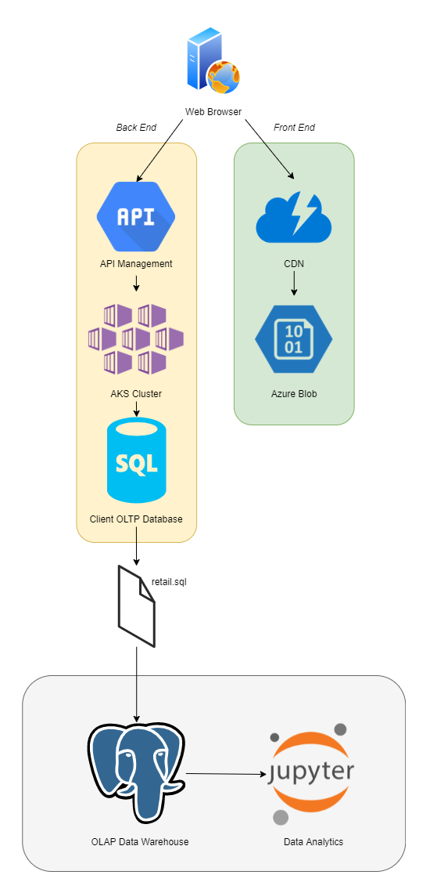

# Python Data Analytics

London Gift Shop is an online store in England that sells gifts and gift-related items. 
Their recent revenue has been tapering off, so they have asked Jarvis to study their sales data and find 
effective ways to market their products.

This project uses **Jupyter**, a **Python** notebook, to perform our analyses. 
Client retail data was pushed and stored to a **PostgreSQL** data warehouse.
**Pandas**, **NumPy**, and **MatPlotLib** are used to wrangle the dataset as well as display the results.

With the help of these analytics, London Gift Shop will develop marketing campaigns that will aim to retain 
old customers as well as attract new ones.

## Implementation
### Architecture
London Gift Shop's front-end consists of a Cloud Content Delivery Network and Azure Blob, which are used to store and deploy their HTML/CSS/JS.

Jarvis was given a copy of London Gift Shop's retail data between the years 2009 and 2011 as a SQL file from their OLTP database.
We then stored it in our PostgreSQL warehouse and analyzed it using Jupyter.
  

> London Gift Shop's web architecture, including our data warehouse and analytics software.

## Data Analytics and Wrangling

Jupyter Notebook: [retail_data_analytics_wrangling.ipynb](retail_data_analytics_wrangling.ipynb)

Using the RFM market research method, London Gift Shop decided to focus on three types of customers (segments):
 - Can't Lose Segment
    > These customers have not bought from the store in a while, however, they used to spend a lot at the store. London Gift Shop can provide personalized deals on previously purchased goods, as well as other related items.
 - Hibernating Segment
    > These customers have not shopped in a very long time. London Gift Shop can try offering coupons for discounts to see if it can bring these customers back.
 - Champions Segment
    > Sometimes known as 'whales', these customers spend the most and are responsible for a majority of the revenue. It is critical to retain these customers or risk massive profit losses. London Gift Shop can run novel campaigns to keep these customers interested.

  
## Further Improvements

* **Predictive Analysis**
    * Only past trends were studied and visualized for the client. By extrapolating the retail data, we can provide suggestions as to what London Gift Shop should do in the future to grow its business.

* **Longer Period of Data**
    * London Gift Shop provided us with approximately two years of sales data. Although there were a lot of sales in that period,
    a more accurate representation of their business can be attained with more years of data.
      
  
* **Detecting the Sources of Profit Loss**
    * The decreasing amount of product sales may be indirectly related to other factors, such as low advertisement conversion rates, which are not provided in the retail data.
    Combining data from London Gift Shop's other data marts (eg. sales or advertising departments) will pinpoint the exact causes of profit loss.