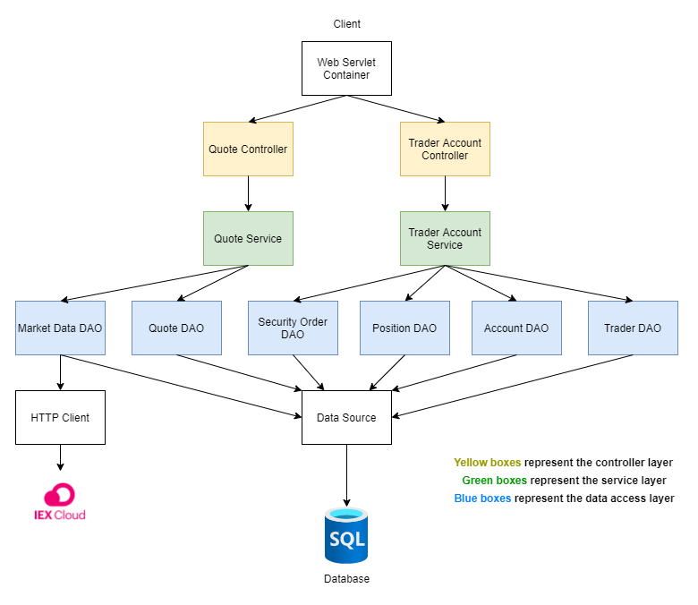

# Trading REST API

* [How to Use](#how-do-i-use-it?)
* [Implementation](#implementation)
* [Deployment and Testing](#deployment-and-testing)
* [Further Improvements](#further-improvements)

Jarvis wishes to update their old and monolithic trading system with a newer one.
This trading REST API provides a PoC with a microservice architecture that will make it easier to scale in the future.
The API allows users to manage trading clients and accounts, as well as pull and post market data.

Created in **Java** using the **Spring** framework and **Maven** packaging tool. 
**SQL** scripts are used to initialize the database. Deployed using **Docker**.

## How do I use it?

Before using the application, ensure **Docker** is installed. A **CentOS 7** Linux VM is recommended to ensure compatibility.

First, create a Docker network so that our containers can communicate.
```
$ sudo docker network create trading-net
```

Next, pull the database and application Docker images from DockerHub:
```
$ docker pull nalimuradov/trading-psql
$ docker pull nalimuradov/trading-app
```

Once created, we can make some containers using those images:
```
$ docker run \
  --name trading-psql-dev \
  -e POSTGRES_PASSWORD=YOUR_PASSWORD \
  -e POSTGRES_DB=YOUR_DATABASE \
  -e POSTGRES_USER=YOUR_USERNAME \
  --network trading-net \
  -d -p 5432:5432 trading-psql
  
$ docker run \
  --name trading-app-dev \
  -e "PSQL_URL=jdbc:postgresql://trading-psql-dev:5432/YOUR_DATABASE" \
  -e "PSQL_USER=YOUR_USERNAME" \
  -e "PSQL_PASSWORD=YOUR_PASSWORD" \
  -e "IEX_PUB_TOKEN=YOUR_IEX_PUB_TOKEN" \
  --network trading-net \
  -p 8080:8080 -t trading-app
```

You will need to provide your database **name**, **password**, **username**, and **IEX API token**.

Once done, we can use the trading API by entering the following into our browser:

```
http://localhost:8080/swagger-ui.html
```


> Our REST API shown with the help of SwaggerUI.


## Implemenation

### Architecture



The application uses a DAO design to separate concerns into different layers. **Spring Boot** is used to create the microservices with the help of **Apache Tomcat's** web-servlet functionality.

The upper **controller** layer deals with user requests. 
It contains the REST API calls the user can make, and it is what is seen in Swagger. 
The controller then takes the user input and passes it to the service layer.

The **service** layer deals with the business logic of the application, where we ensure that the input given is in an acceptable format
Once validated, the request is then sent to the DAO layer.

The **DAO** layer will then take these requests and directly communicate with the database to add, delete, or modify the data.
The DAO uses **JDBC** to connect to the database and perform SQL queries.

A **PostgreSQL** database is used, however, this system was designed using a **JDBC** datasource, meaning that any SQL database can be configured.

Lastly, the **IEX Cloud** is a web API that contains current stock information. All of our market data is obtained from here.

### REST API Usage
#### Swagger
Swagger is a UI tool that allows us to create interfaces for our REST APIs. It provides a visual representation of our API, allowing clients to get a better sense of the PoC.

#### Quote Controller

The quote controller gets security data from IEX and stores it in our database.

  | Endpoint  | Usage |
  | ------------- | ------------- |
  | **GET** ```/quote/dailyList``` | Lists all securities that are available to trade. |
  | **GET** ```/quote/iex/ticker/{ticker}``` | Show IEX quote with the given ticker. |
  | **PUT** ```/quote/ticker/{ticker}``` | Add a new ticker to the daily list. |
  | **POST** ```/quote``` | Update a quote in the quote table. |
  | **POST** ```/quote/iexMarketData``` | Update the quote table using IEX market data. |
  
#### Trader Controller

The trader controller manages trader and account information on the platform. It allows users to create and delete traders,
as well as withdraw or deposit money from an account.

  | Endpoint  | Usage |
  | ------------- | ------------- |
  | **DELETE** ```/trader/traderId/{traderId}``` | Delete a trader with a given trader ID. |
  | **POST** ```/trader``` | Create a trader. |
  | **POST** ```/trader/firstname/{firstname}/lastname/{lastname}/dob/{dob}/country/{country}/email/{email}``` | Create a trader with specific characteristics. |
  | **PUT** ```/trader/deposit/traderId/{traderId}/amount/{amount}``` | Deposit money into an account. |
  | **PUT** ```/trader/withdraw/traderId/{traderId}/amount/{amount}``` | Withdraw money from an account. |

## Deployment and Testing

The controllers, services, and DAOs were integration tested using JUnit 4 and met the acceptable benchmark of 60% code coverage.
Thanks to Spring, we can *autowire* the necessary classes for our tests so that we can test each layer of the DAO for functionality.


We deployed our Docker images to DockerHub, allowing anyone to pull them. 
The PSQL image uses the PostgreSQL base image, while the main application image uses the JDK 8 Alpine base image.
We then build our two respective containers and connect them through our Docker network.

## Further Improvements

* **Wider selection of endpoints**
    * While the current endpoints can effectively demonstrate this proof-of-concept application, 
      more endpoints would be almost necessary for a full deployment to provide a greater range of usable functions. 
      For example, we can include endpoints that deal with the dashboard and orders directly.
      

* **Alternate stock exchanges**
    * A nice improvement that would also help with testing the PoC would be to utilize different stock exchanges such as NASDAQ or NYSE.
  Having a wider selection of exchanges will provide value to a greater range of potential users.


* **Startup script**
    * Rather than providing the instructions to set up the Docker images and network, I could add a startup script that pulls the 
  images and sets up the network automatically. This would help the user start the application faster as well as minimize the chance of error.
